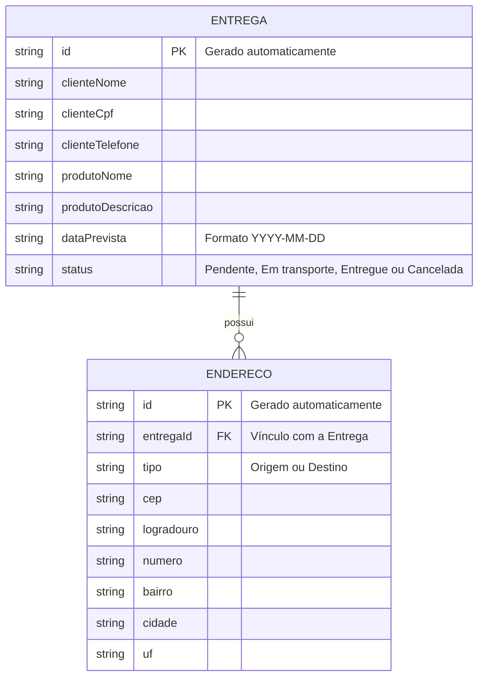

# 🛠️ Especificação Técnica (Tech Spec) - Entrega Fácil

Este documento detalha o modelo de dados, os relacionamentos entre as entidades e a estrutura prevista para a API Fake do sistema **Entrega Fácil**.

## 1. Modelo de Dados (Diagrama ER)

Abaixo está o Diagrama Entidade-Relacionamento (DER) que representa a estrutura prevista para o `db.json` e como as informações do sistema se relacionam.



## 2. Dicionário de Dados

Breve explicação das entidades principais:

* **Entregas:** Responsável por armazenar os dados principais necessários para identificar e acompanhar uma entrega.

  * `id`: Identificador único gerado pelo JSON Server.
  * `clienteNome`: Nome da pessoa responsável pelo recebimento da entrega.
  * `clienteCpf`: CPF informado no cadastro.
  * `clienteTelefone`: Telefone para contato.
  * `produtoNome`: Nome ou identificação do produto transportado.
  * `produtoDescricao`: Descrição complementar opcional do produto.
  * `dataPrevista`: Data prevista para realização da entrega.
  * `status`: Situação atual da entrega. Aceita os valores **Pendente**, **Em transporte**, **Entregue** ou **Cancelada**.

* **Endereços:** Responsável por armazenar os locais relacionados a cada entrega.

  * `id`: Identificador único gerado pelo JSON Server.
  * `entregaId`: Chave estrangeira que relaciona o endereço a uma entrega.
  * `tipo`: Identifica se o endereço representa a **Origem** ou o **Destino**.
  * `cep`: CEP utilizado para consulta do endereço.
  * `logradouro`: Rua, avenida ou outro logradouro.
  * `numero`: Número informado manualmente pelo operador.
  * `bairro`: Bairro do endereço.
  * `cidade`: Cidade do endereço.
  * `uf`: Unidade Federativa do endereço.

Cada entrega deverá possuir dois endereços associados: um do tipo **Origem** e outro do tipo **Destino**.

## 3. Rotas da API (JSON Server)

A aplicação utilizará uma API local simulada pelo JSON Server para persistir e consultar os dados.

Principais endpoints previstos:

* `GET /entregas` - Retorna a lista de entregas cadastradas.
* `POST /entregas` - Cadastra uma nova entrega.
* `GET /entregas/:id` - Retorna os dados de uma entrega específica.
* `PATCH /entregas/:id` - Atualiza informações de uma entrega, como seu status.
* `GET /enderecos?entregaId=1` - Retorna os endereços relacionados a uma entrega.
* `POST /enderecos` - Cadastra um endereço de origem ou destino relacionado a uma entrega.

## 4. Estrutura do Banco de Dados (db.json)

Esta é uma representação inicial da estrutura do banco de dados simulado que poderá ser utilizada posteriormente pelo JSON Server.

```json
{
  "entregas": [
    {
      "id": "1",
      "clienteNome": "João Silva",
      "clienteCpf": "123.456.789-00",
      "clienteTelefone": "(42) 99999-9999",
      "produtoNome": "Notebook",
      "produtoDescricao": "Notebook para entrega",
      "dataPrevista": "2026-09-10",
      "status": "Pendente"
    }
  ],
  "enderecos": [
    {
      "id": "1",
      "entregaId": "1",
      "tipo": "Origem",
      "cep": "85000-000",
      "logradouro": "Rua Exemplo",
      "numero": "100",
      "bairro": "Centro",
      "cidade": "Guarapuava",
      "uf": "PR"
    },
    {
      "id": "2",
      "entregaId": "1",
      "tipo": "Destino",
      "cep": "80000-000",
      "logradouro": "Rua Exemplo",
      "numero": "250",
      "bairro": "Centro",
      "cidade": "Curitiba",
      "uf": "PR"
    }
  ]
}
```